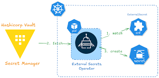
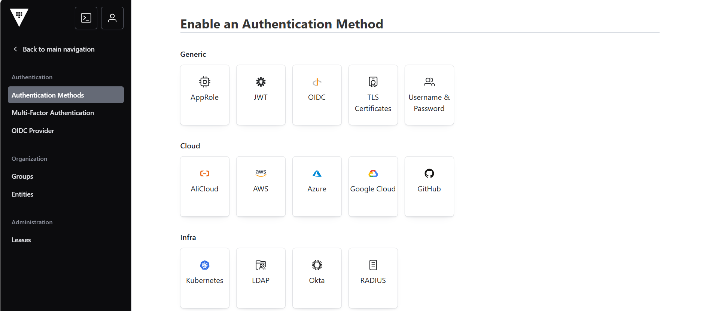
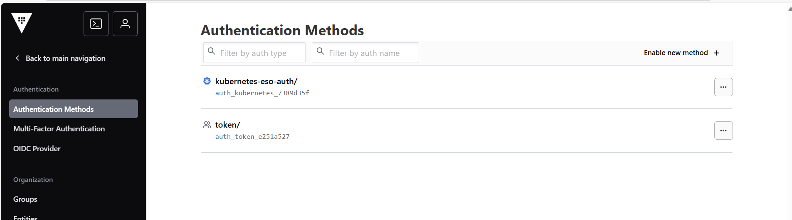
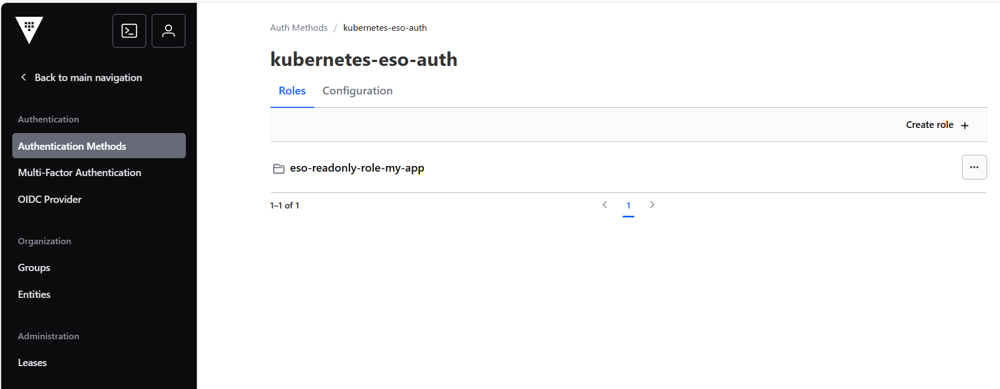
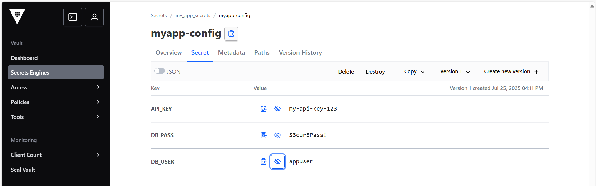
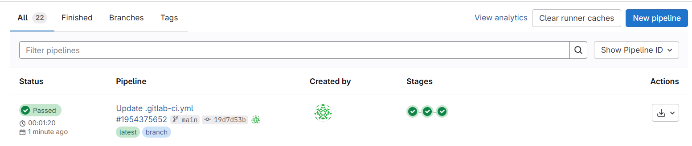
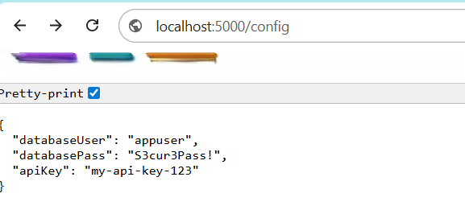

# Vault-External-Secrets-K8s-CI-Pipeline



[](https://artifacthub.io/packages/helm/external-secrets/external-secrets)
[](https://operatorhub.io/operator/external-secrets)

## Overview
This repository demonstrates a full CI/CD pipeline integrating **HashiCorp Vault** with a **Kubernetes cluster** using **External Secrets Operator (ESO)**. It automates application deployment via **GitLab CI/CD**, ensuring that sensitive data is securely fetched from Vault and injected into Kubernetes workloads.

---

## Table of Contents

1. [Install vault](#1-install-vault)
2. [Configure Vault Authentication](#2-configure-vault-authentication)
3. [Install External Secrets Operator (ESO)](#3-installing-external-secrets-operator-eso-on-kubernetes-with-helm)
4. [GitLab CI/CD Pipeline](#4-gitlab-cicd-pipeline)
5. [Testing & Verification](#5-testing--verification)

---

## STEP 1. Install vault

```bash
helm repo add hashicorp https://helm.releases.hashicorp.com
helm repo update
kubectl create namespace vault-secondary
helm install -n vault-secondary secondary-vault hashicorp/vault
```

### Initialize and Unseal Vault

After Vault is deployed, you need to initialize and unseal it. These commands must be run **inside the Vault pod**.

First, open a shell into the Vault pod:

```bash
kubectl exec -it -n vault-secondary <vault-pod-name> -- /bin/sh
export VAULT_ADDR='http://127.0.0.1:8200'
vault operator init
vault operator unseal     # run 3 times with different unseal keys
vault login <root_token>
```

---

### Login to Vault Web UI

To access the Vault Web UI, you have two options:

1. **Port-forward (quick local access):**

```bash
kubectl -n vault-secondary port-forward svc/secondary-vault --address 0.0.0.0 8200:8200
```

OR

2. **Creating ingress:**

```bash
apiVersion: networking.k8s.io/v1
kind: Ingress
metadata:
  name: secondary-vault
  namespace: vault-secondary
  annotations:
    nginx.ingress.kubernetes.io/ssl-redirect: "false"
spec:
  ingressClassName: nginx
  rules:
  - host: <secondary-vault.example.com>
    http:
      paths:
      - path: /
        pathType: Prefix
        backend:
          service:
            name: secondary-vault
            port:
              number: 8200
```

### Initialize and Unseal Vault

After accessing Vault (via Web UI or port-forward), you must **initialize and unseal** it before it can store or serve secrets.

Vault can be unsealed either **via the Web UI** or **via the CLI inside the Vault pod**.

---


#### 1. Initialize & Unseal via Web UI

1. Access the Vault Web UI:
2. Log in with the `root_token` (once initialized).
3. Follow the UI prompts:
   - Click **“Initialize Vault”**.
   - Generate the unseal keys.
   - Enter the unseal keys (at least 3 of 5 by default) to unseal Vault.

---

#### 2. Initialize & Unseal via CLI (inside the Vault pod)

If you prefer using the terminal, run:

```bash
# Access the Vault pod
kubectl exec -it -n vault-secondary secondary-vault-0 -- /bin/sh

# Set Vault address
export VAULT_ADDR='http://127.0.0.1:8200'

# Initialize Vault (only once, will output unseal keys and root token)
vault operator init

# Unseal Vault (run with 3 different keys)
vault operator unseal <unseal_key_1>
vault operator unseal <unseal_key_2>
vault operator unseal <unseal_key_3>

# Login using the root token
vault login <root_token>
```

>Important: Save the unseal keys and root token securely. They are needed for future unseals and administration.

---

## STEP 2. Configure Vault Authentication



In order for ESO to authenticate with Vault, you must configure an authentication method.  
While **Kubernetes authentication** is the most common option (allowing ESO to use ServiceAccounts for login), you can also use other methods supported by Vault, such as **AppRole, Token, or OIDC**, depending on your security requirements.

Example below shows **Kubernetes Authentication** setup in the Vault UI:




```bash
#Define a policy to allow read-only access:

To allow ESO to fetch secrets from Vault, you must create a **read-only ACL policy**.  
This policy grants `read` and `list` permissions, so ESO can access only the required secrets.

Example (HCL format):

```hcl
path "*" {
  capabilities = ["read", "list"]
}
```

### Create ServiceAccount for ESO

The `ClusterSecretStore` configuration references a ServiceAccount that ESO will use to authenticate with Vault.  
Create the ServiceAccount in the `external-secrets` namespace:

```yaml
apiVersion: v1
kind: ServiceAccount
metadata:
  name: eso-myapp-css-sa
  namespace: external-secrets
```

---

## STEP 3. Installing External Secrets Operator (ESO) on Kubernetes with Helm

This guide explains how to install the **External Secrets Operator (ESO)** on Kubernetes, which enables automatic syncing of secrets from providers like **HashiCorp Vault** into Kubernetes secrets.

```bash
helm repo add external-secrets https://charts.external-secrets.io
helm repo update
kubectl create namespace external-secrets
helm install external-secrets external-secrets/external-secrets -n external-secrets --create-namespace
kubectl get pods -n external-secrets
kubectl get all -n external-secrets
```

---

### Create Cluster Secret Store

The `ClusterSecretStore` (CSS) must be **manually created by the administrator**. It is **not created automatically** when you define an `ExternalSecret`. Without a valid `ClusterSecretStore`, ESO cannot connect to Vault or retrieve secrets.

Example:

```bash
apiVersion: external-secrets.io/v1
kind: ClusterSecretStore
metadata:
  name: vault-backend-my-app
spec:
  conditions:
    - namespaceSelector:
        matchLabels:
          kubernetes.io/metadata.name: my-app
  provider:
    vault:
      server: <http://secondary-vault.example.com>  # Vault API endpoint ESO will connect to
      path: my_app_secrets                         # Base path in Vault where secrets are stored (e.g., KV v2 engine)
      version: v2                                  # Version of the Vault KV secrets engine (v1 or v2)
      auth:
        kubernetes:
          mountPath: kubernetes-eso-auth           # Path in Vault where Kubernetes auth method is enabled
          role: eso-readonly-role-my-app           # Vault role that ESO will assume (mapped to policy with read access)
          serviceAccountRef:
            name: eso-myapp-css-sa                 # Kubernetes ServiceAccount ESO will use to authenticate to Vault
            namespace: external-secrets            # Namespace where the ServiceAccount exists
```

```bash
kubectl apply -f my-app-css.yml
#verify
kubectl get ClusterSecretStore vault-backend-my-app
```

### Create Secrets For Application

create a secret in Vault that will be synced to Kubernetes by ESO.

Example secret (`my_app_secrets`):

```json
{
  "databaseUser": "appuser",
  "databasePass": "S3cur3Pass!",
  "apiKey": "my-api-key-123"
}
```



## STEP 4. GitLab CI/CD Pipeline

This project uses **GitLab CI/CD** to automate building, containerizing, and deploying the application (`myapp`) to Kubernetes, while ensuring that **no secrets are hardcoded**. All sensitive data is securely stored in **HashiCorp Vault** and dynamically retrieved via **External Secrets Operator (ESO)**, so credentials never appear in the source code, CI variables, or manifests.

**Build > Push Image > Deploy**



---

## STEP 5. Testing & Verification

After completing the Vault, External Secrets Operator (ESO), and CI/CD pipeline setup, verify that the system works end-to-end by performing the following checks:

**Access the Application**

- If an Ingress is configured for `myapp`, confirm it responds via the configured domain.
- If using port-forward, run:

  ```bash
  kubectl -n my-app port-forward svc/myapp-service 5000:80
  ```

  Access via `http://localhost:5000`

**Example:**

